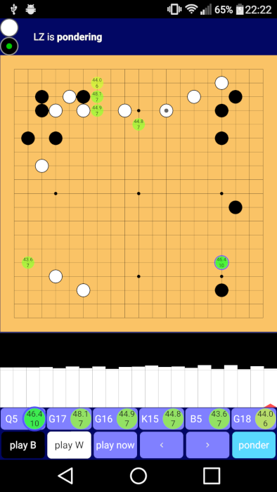

# Lazy Baduk

A Go game analysis tool for Android, providing the power of Leela Zero
on your smartphone.

[Leela Zero](https://zero.sjeng.org/) is a strong Go bot, created as
an independent implementation of the Alphago Zero deep learning
algorithms. It's now so strong that even on a phone, with relatively
few playouts, it can achieve a high dan level.

Note that Leela Zero's analysis uses as much CPU power as it can, and
will rapidly burn through battery power if not charging.

# Download

Lazy Baduk is available [on Google
Play](https://play.google.com/store/apps/details?id=net.inclem.lazybaduk). This
version currently uses the last 15x192 network, from July 2018, in
order to try to be as fast as practical on a phone. Larger networks
take longer to initialise and to generate playouts.

Versions incorporating other networks are available for direct download:
- [Latest 15x192 network d351f06e](https://github.com/inclement/LazyBaduk/releases/download/0.6/lzviewer15x192-0.6-release-signed.apk): the same as the version on Google Play
- [Latest 20x256 network 33986b7f](https://github.com/inclement/LazyBaduk/releases/download/0.6/lzviewer20x256-0.6-release-signed.apk)
- [Latest 40x256 network 85a93684](https://github.com/inclement/LazyBaduk/releases/download/0.6/lzviewer40x256-0.6-release-signed.apk): this one especially is much larger and slower to load than the 15x192 version
- [Elfv2](https://github.com/inclement/LazyBaduk/releases/download/0.6/lzviewerElfv2-0.6-release-signed.apk): the [ELF OpenGo version 2](https://github.com/pytorch/elf) weights converted for use with Leela Zero. ELF is Facebook's own implementation of a zero knowledge algorithm, and is very strong (network size 20x256).
- [9x9](https://github.com/inclement/LazyBaduk/releases/download/0.6/lzviewer9x9-0.6-release-signed.apk): uses the 9x9 weights generated by @sbf2000 [here](https://github.com/leela-zero/leela-zero/issues/1291) (these may not be the strongest 9x9 weights available)

# Technical details

Lazy Baduk is written in Python using [Kivy](https://kivy.org/). This
means that it can also run on the desktop.

The app includes a Leela Zero binary compiled for Android, so all
analysis is run on your device. It does not currently use the GPU,
although it might be possible to compile a version supporting OpenCL
for devices that support it.
